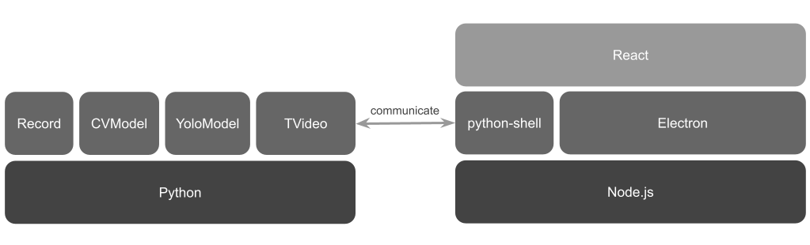

# TVideo

```
TVideo
├─ config.py
├─ controllers
│  └─ setting.py
├─ main.py
├─ models
│  ├─ communicate.py
│  ├─ CVModel
│  │  ├─ CVModel.py
│  │  └─ __init__.py
│  ├─ helper.py
│  ├─ RESAModel
│  │  ├─ RESAModel.py
│  │  └─ __init__.py
│  ├─ TVideo
│  │  ├─ Process.py
│  │  ├─ Record.py
│  │  ├─ TVideo.py
│  │  └─ __init__.py
│  ├─ YoloModel
│  │  ├─ YoloModel.py
│  │  └─ __init__.py
│  └─ __init__.py
├─ openh264-1.8.0-win64.dll
├─ README.md
├─ requirements.txt
├─ static
│  ├─ ico
│  ├─ img
│  ├─ model
│  │  ├─ lp.names
│  │  └─ lp_yolov4.cfg
│  └─ preset
│     └─ defaultSetting.json
├─ store
│  ├─ output
│  ├─ records
│  │  └─ lastRecordId.txt
│  └─ settings.json
└─ views
   └─ lang
      ├─ standard.json
      └─ zh-TW.json
```

## structure



***

## Command

#### 檢測違規行為

```
$ python main.py detect VIDEOPATH NUMBER VIOLATIONTYPE
```

#### 尋找車牌號碼

```
$ python main.py findNumber VIDEOPATH NUMBER 
```

`VIDEOPATH`： 影片路徑

`NUMBER`： 車牌號碼

`VIOLATIONTYPE`： 違規行為種類

***

## 簡單可分離使用

YoloModel()

***

# Developer's Documentation

## Table of Contents

* [CVModel](https://github.com/Chizi-P/TVideo/blob/main/README.md#class-cvmodel)
* [helper](https://github.com/Chizi-P/TVideo/blob/main/README.md#helper)
* [YoloModel](https://github.com/Chizi-P/TVideo/blob/main/README.md#class-yolomodelcvmodel)
* [TObj](https://github.com/Chizi-P/TVideo/blob/main/README.md#class-tobjenum)
* [VehicleData](https://github.com/Chizi-P/TVideo/blob/main/README.md#class-vehicledata)
* [LicensePlateData](https://github.com/Chizi-P/TVideo/blob/main/README.md#class-licenseplatedata)
* [TrafficLightState](https://github.com/Chizi-P/TVideo/blob/main/README.md#class-trafficlightstateenum)
* [TrafficLightData](https://github.com/Chizi-P/TVideo/blob/main/README.md#class-trafficlightdata)
* [LaneData](https://github.com/Chizi-P/TVideo/blob/main/README.md#class-lanedata)
* [TFrameData](https://github.com/Chizi-P/TVideo/blob/main/README.md#class-tframedata)
* [Direct](https://github.com/Chizi-P/TVideo/blob/main/README.md#class-directenum)
* [ProcessState](https://github.com/Chizi-P/TVideo/blob/main/README.md#processstateenum)
* [TVideo](https://github.com/Chizi-P/TVideo/blob/main/README.md#class-tvideo)
* [TVideoSchedule](https://github.com/Chizi-P/TVideo/blob/main/README.md#class-tvideoschedule)
* [Process](https://github.com/Chizi-P/TVideo/blob/main/README.md#class-process)
* Deprecated
   * [DetectResult](https://github.com/Chizi-P/TVideo/blob/main/README.md#class-detectresult-%E6%A3%84%E7%94%A8)
   * [DetectResults](https://github.com/Chizi-P/TVideo/blob/main/README.md#class-detectresults-%E6%A3%84%E7%94%A8)

***

### class CVModel

用於輸入為影像的模型的抽象對象

```python
__init__(self) -> None
```

#### @staticmethod

```python
getFrames(videoCapture: cv2.VideoCapture) -> List[np.ndarray]
```

獲取 `videoCapture` 中每一幀的影像

```python
getCenterPosition(points: List[List[int]]) -> List[int]
```

獲取中心點位置。

```python
boxArea(box: List[int]) -> float
```

計算 `box` 的面積。

```python
IoU(rect1: List[int], rect2: List[int]) -> float
```

計算 `rect1` 與 `rect2` 的 IoU。

```python
crop(image: np.ndarray, box: List[int]) -> np.ndarray
```

根據 `box` 的位置裁剪 `image`，返回新的圖像。

```python
expand(box: List[int], px: int) -> List[int]
```

擴大 `box` 的長寬 `px` 像素。

```python
offset(box: List[int], x: int, y: int) -> List[int]
```

偏移 `box` 的整體位置。

```python
overexPose(image: np.ndarray) -> np.ndarray
```

#### @abstractmethod

```python
detectImage(self, image: cv.Mat) -> DetectResult
```

必須重新定義該方法。

定義：利用模型辨識傳入之圖像並回傳 `DetectResult` 的類型

#### Instance Method

```python
detectVideo(self, videoCapture: cv.VideoCapture, interval: int = 1) -> List[DetectResult]
```

`interval` : 根據該值的間隔採樣辨識 `videoCapture` 中的幀。

***

### helper

### class dotdict(dict)

讓 dict 可以用 . 取值。

#### @staticmethod

```python
deep(d: Dict[Any]) -> Dict[Any]
```

深度讓 `dict` 可以以 `.` 取值賦值。

```python
imshow(img: np.ndarray, title = '')
```

以窗口顯示 `img` 圖像。

```python
saveVideo(images, path, fps = 30, fourccType = 'mp4v')
```

存儲 `images` 圖像列表到 `path` 路徑上。

***

### class YoloModel(CVModel)

```python
__init__(
       self, 
       namesPath     : str, 
       configPath    : str, 
       weightsPath   : str, 
       confidence    : float = 0.5, 
       threshold     : float = 0.2, 
       minConfidence : float = 0.2
)
```

加載模型

`namesPath` : .names 文件的路徑

`configPath` : .cfg 文件的路徑

`weightsPath` : .weights 文件的路徑

預設：

`confidence` : 至少要在此信心以上

`threshold` : 閥值, 可重疊程度

`minConfidence` : 最小信心

> 加載 `.names` 文件中的 `label`　和定義各 `label` 的顔色

#### @staticmethod

```python
yoloFormatToTwoPoint(centerX: int, centerY: int, width: int, height: int) -> List[int, int, int, int]
```

把中心點坐標和長寬轉換成左上角和右下角點的坐標。

返回 `[p1x, p1y, p2x, p2y]`

### Instance Method

```python
detect(self, image: np.ndarray) -> Tuple[List[List[int]], List[int], List[float]]
```

使用模型辨識圖像，返回 `boxes`, `classIDs`, `confidences`

```python
detectImage(self, image: cv.Mat) -> DetectResult
```

使用模型辨識圖像（棄用）

```python
showConfig(self) 
```

未定義

***

### class TObj(Enum)

`Undefined`

`Vehicle`

`LicensePlate`

`TrafficLight`

`Lane`

***

### class VehicleData

一載具的數據

```python
__init__(self, image: np.ndarray, box: List, confidence: float, type: str)
```

```python
calc(self)
```

***

### class LicensePlateData

一車牌的數據

```python
__init__(self, image: np.ndarray, box: List, confidence: float)
```

```python
calc(self)
```

計算數據

`cornerPoints` : 車牌的四個角點

`correctImage` : 矯正的圖像

`centerPosition` : 車牌質心點位置

`number` :  車牌號碼

#### @staticmethod

```python
getCornerPoints(image: np.ndarray) -> List
```

獲取車牌的4個角點

```python
correct(image: np.ndarray, cornerPoints, w: int, h: int) -> np.ndarray
```

根據 `cornerPoints` 的 4 個角點矯正車牌圖片 `image`
返回新圖片

```python
getNumber(image: np.ndarray) -> str
```

獲取辨識 `image` 得到的車牌號碼，根據台灣車牌號碼規則

***

### class TrafficLightState(Enum)

紅綠燈狀態

`unknow`

`red`

`yellow`

`green`

***

### class TrafficLightData

```python
__init__(self,image: np.ndarray, box: List, confidence: float)
```

```python
calc(self)
```

計算數據

`state` : 紅綠燈狀態

#### @staticmethod

```python
getTrafficLightColor(image: np.ndarray) -> Tuple[TrafficLightState, np.ndarray]
```

辨識 `image` 的紅綠燈狀態。

```python
threePartOfTrafficLight(image: np.ndarray) -> List[np.ndarray]
```

將 Blur 圖片分三等份

```python
cntsOfeachPart(threePartImgs: List[np.ndarray]) -> TrafficLightState
```

```python
ColorDectect(image: np.ndarray) -> TrafficLightState
```

***

### class LaneData

車道線數據

```python
__init__(self, image: np.ndarray, lane: List[List[int]], confidence: float)
```

```python
calc(self)
```

計算數據

`vanishingPoint` : 消失點

```python
getVanishingPoint
```

根據車道線獲取消失點

***

### class TFrameData

一幀的數據

```python
def __init__(self, frame: np.ndarray)
```

```python
getTargetLicensePlatePosition(self, targetLicensePlateCodename) -> Union[List[int], None]
```

獲取目標車牌的位置

***

### class Direct(Enum)

`left` : 向左

`right` : 向右

`straight` : 直行

***

### class ProcessState(Enum)

`next` : 繼續下一個 Process

`nextLoop` : 繼續下一個 Schedule

`stop` : 結束當前 Schedule

***

### class TVideo

一影片的數據

```python
__init__(
self, path: str, number: str = '', lastCodename : int = 0)
```

#### @staticmethod

```python
__getVideoDetails(path: str) -> Any:
```

獲取 `path` 的影片的詳細數據

返回 `list` 中順序包含
`frames` : 影片幀的圖像
`width` : 影片寬度
`height` : 影片高度
`fps`
`frameCount` : 影片幀的數目

```python
runProcess(self, schedule: Callable[[List[indexType], int], indexType], *processes: ForEachFrameData, maxTimes: int = None)
```

```python
findCorresponding(self, frameData1: TFrameData, frameData2: TFrameData, threshold: float = 0.1)
```

計算前幀 `frameData1` 與 後幀 `frameData2` 兩幀之間辨識結果的 `boxes` 的關係，位置與形狀接近會認為為同一物品，給予與前幀物品一樣的 `codename`，如果前幀沒有 `codename` 或沒對應物品會給予新的 `codename`。
計算方法是計算兩幀 `box` 之間的 IoU ，IoU 值大於 `threshold` 並且為計算的所有 box 中最大的，為同一物品。

```python
newCodename(self) -> int
```

使用該方法獲取新 `codename`。

```python
getTargetLicensePlatePath(self) -> List[List[int]]
```

獲取目標車牌在影片中的路徑，返回車牌中心點坐標組成的 `list`。
`list` 長度同影片幀數目
沒路徑位置的幀會儲存 `Node`

```python
getVaildTargetLicensePlatePath(self) -> List[List[int]]
```
(未完善)

獲取多段目標車牌在影片中的路徑。

```python
save(self, path: str, start: int = None, end: int = None, fps: float = None, fourccType: str = 'avc1')
```

儲存 `framesData` 中每一個 `frame` 成為影片。

`path` : 儲存在該路徑，路徑包含影片名稱和後綴

`start` : 從該幀數開始裁切

`end` : 裁切到該幀數

`fps` : 幀率，默認與原影片相同

`fourccType` : 視頻數據流格式，默認 `avc1`

***

### class TVideoSchedule

#### @staticmethod

```python
once(indexs: List[indexType], frameCount: int) -> indexType
```

處理一次。

```python
index(i: int, times: int = 1)
```

處理第 `i` 幀 `times` 次。

```python
forEach(indexs: List[indexType], frameCount: int) -> indexType
```

順序處理每一幀。

```python
forEachStep(step: int)
```

間隔 `step` 幀處理一幀。

```python
range(start: int, end: int, step)
```

處理從 `start` 到 `end` 每一幀。

```python
forEachStepAll(step: int)
```

間隔 `step` 幀處理一幀，處理到最後，回到開頭從第 2 幀間隔 `step` 幀處理一幀，以此類推，直到影片全部幀都處理過。

```python
random(indexs: List[indexType], frameCount: int) -> indexType
```

打亂處理的順序，處理全部幀，不會重複處理。

```python
randomIndex(indexs: List[indexType], frameCount: int) -> indexType
```

隨機挑選一幀處理。

```python
forward(start: int, length: int = None, step: int = 1)
```

從 `start` 開始順序間隔 `step` 處理，處理到 `length` 幀後。
`length` 包含跳過的幀數，`length` 默認到影片結束。

```python
backward(start: int, length: int = None, step: int = -1)
```

從 `start` 開始順序間隔 `step` 處理，處理到 `length` 幀後。
`length` 包含跳過的幀數，`length` 默認到影片開始。

***

### class Process

```python
__init__(self, process)
```

#### @staticmethod

```python
showIndex(frameData: TFrameData, frameIndex: int, tvideo: TVideo) -> ProcessState
```

打印出當前處理中的幀數。

```python
yolo(frameData: TFrameData, frameIndex: int, tvideo: TVideo) -> ProcessState
```

使用載入之 yolo 模型辨識。

```python
calcLicensePlateData(frameData: TFrameData, frameIndex: int, tvideo: TVideo) -> ProcessState
```

計算車牌的額外數據。

```python
calcCenterPosition(frameData: TFrameData, frameIndex: int, tvideo: TVideo) -> ProcessState
```

計算車牌的中心點位置。

```python
findCorresponding(reverse: bool = False)
```

計算當前幀與前一幀的物件的關係，如果位置與形狀接近，會標記相同的 `codename` 屬性。

`reverse` : 是否兩幀相反比較，用於在向前推敲關係的時候。

```python
hasCorrespondingTargetLicensePlate(frameData: TFrameData, frameIndex: int, tvideo: TVideo) -> ProcessState
```

是否有對應的車牌號碼。

```python
drawBoxes(frameData: TFrameData, frameIndex: int, tvideo: TVideo) -> ProcessState
```

繪畫模型辨識到物品的矩形。

```python
drawPath(frameData: TFrameData, frameIndex: int, tvideo: TVideo) -> ProcessState
```

繪畫物品的路徑。

```python
findTargetNumber(number: str = None)
```

尋找物品中是否有對應的車牌號碼 `number`。

```python
correspondingTrafficLights(frameData: TFrameData, frameIndex: int, tvideo: TVideo) -> ProcessState
```

```python
drawCurrentTrafficLightState(frameData: TFrameData, frameIndex: int, tvideo: TVideo) -> ProcessState
```

繪畫對應拍攝者所在車道的紅綠燈狀態在輸出圖像中。

```python
cocoDetect(frameData: TFrameData, frameIndex: int, tvideo: TVideo) -> ProcessState
```

使用 coco 模型對幀辨識。

```python
updateRangeOfTargetLicensePlate(frameData: TFrameData, frameIndex: int, tvideo: TVideo) -> ProcessState
```

更新對應車牌號碼所在的範圍。

```python
calcPathDirection(frameData: TFrameData, frameIndex: int, tvideo: TVideo) -> ProcessState
```

計算車輛的去向，左轉、直行或右轉。

```python
intersectionOfLPAndTL(frameData: TFrameData, frameIndex: int, tvideo: TVideo) -> ProcessState
```

***

***

### class DetectResult() (棄用)

```python
__init__(
       self, 
       image      : np.ndarray, 
       labels     : List[str] = [], 
       threshold  : float     = 0.2, 
       confidence : float     = 0.2, 
       colors     : List      = None
)
```

`classIDs` : 辨識到的多個分類

`boxes` : 多個分類的邊框位置

`confidences` : 多個分類的可信程度

`boxes` 中每個位置應該儲存的的資料：

該分類在圖上的 `[p1x, p1y, p2x, p2y]` ，分別為左上角 `p1x, p1y` 和右下角　`p2x, p2y` 點的位置

三個參數中同 `index` 的值為同一個結果

#### @staticmethod

```python
checkColor(color)
```

```python
getAutoSelectColors(self)
```

```python
setColors(self, colors)
```

```python
setColor(self, index, color)
```

```python
add(self, classID, box, confidence)
```

用於模型的辨識結果

```python
@property
count(self)
```

```python
hasResult(self)
```

是否有至少一個結果

```python
getNMSDetectResult(self)
```

```python
calcNMS(self)
```

```python
@property
AllIndex(self)
```

```python
crop(self, boxIndex)
```

以 `boxes` 中的第 `boxIndex` 個裁剪 `image` 圖片

```python
cropAll(self, classID, indexs)
```

```python
table(self)
```

打印出列表

```python
msg(self, classID, _, confidence, i)
```

```python
drawBoxes(self, indexs, callbackReturnText = None)
```

```python
draw(self, indexs, callbackCroppedImage)
```

***

### class DetectResults() (棄用)

```python
__init__(self, labels = [], colors = None)
```

```python
add(self, detectResult)
```

```python
setColors(self, colors)
```

```python
drawBoxes(self, indexs, callbackReturnTexts = None)
```

```python
loop(self, indexs, callback)
```

```python
draw(self, indexs, callbackCroppedImage)
```

```python
table(self)
```

***

### 待續 ...
